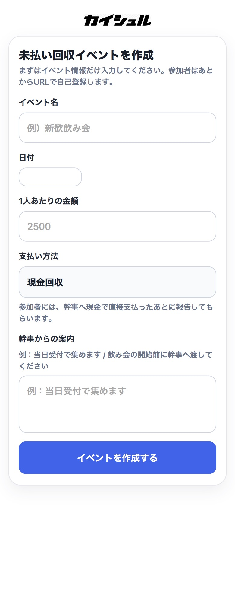
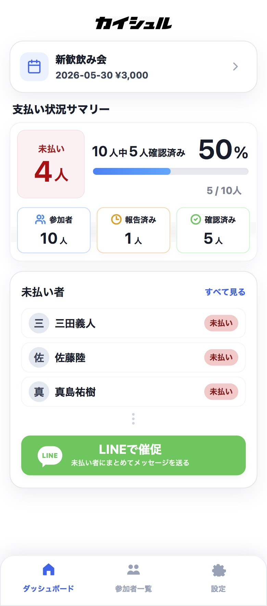
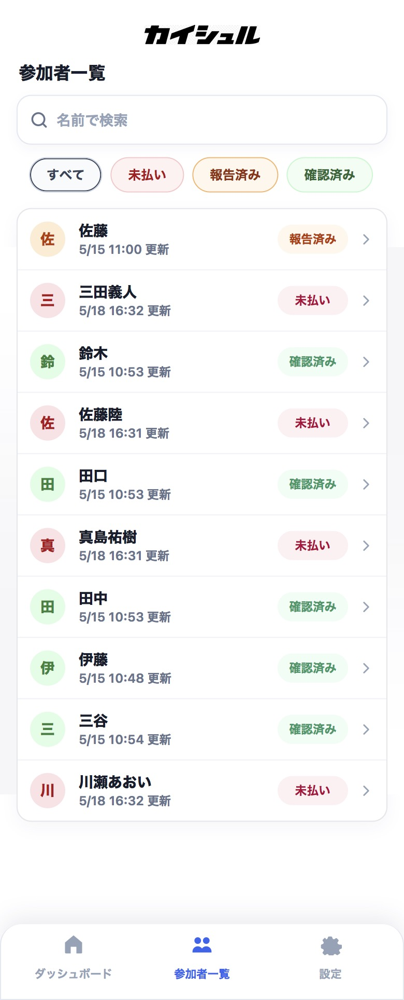
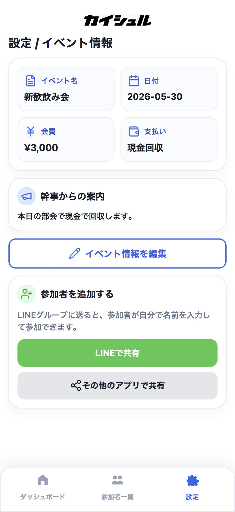

# カイシュル

飲み会やサークル活動における未払い回収の負担を減らすWebアプリです。

## 開発背景
サークル活動の中で、幹事が未払い者を把握したり催促したりする負担が大きいと感じたことをきっかけに開発しました。

## 解決したい課題
- 幹事が誰が未払いか把握しづらい
- 催促が気まずい
- 参加者が自分の支払い状況を確認しづらい
- LINEで共有・催促しやすい導線が必要

## 主な機能
- イベント作成
- 参加者登録
- 未払い / 報告済み / 確認済みのステータス管理
- 幹事用管理画面
- 参加者用画面
- LINE共有・催促メッセージ作成
- localStorageによる最近作成したイベント管理

## 使用技術
- React
- Vite
- Firebase / Firestore
- CSS
- lucide-react

## 工夫した点
- 幹事と参加者で画面を分け、利用者ごとの行動を分かりやすくした
- 未払い回収の「催促しづらさ」という心理的負担に着目した
- スマートフォンでの利用を前提にUIを改善した
- 実際にサークルで幹事を担当する後輩に使ってもらい、フィードバックをもとに改善している

## 今後改善したい点
- TypeScript化
- shadcn/uiなどを用いたUIコンポーネント整理
- 通知機能
- 管理画面の分析機能

- ## 画面イメージ

  
  
  
  

